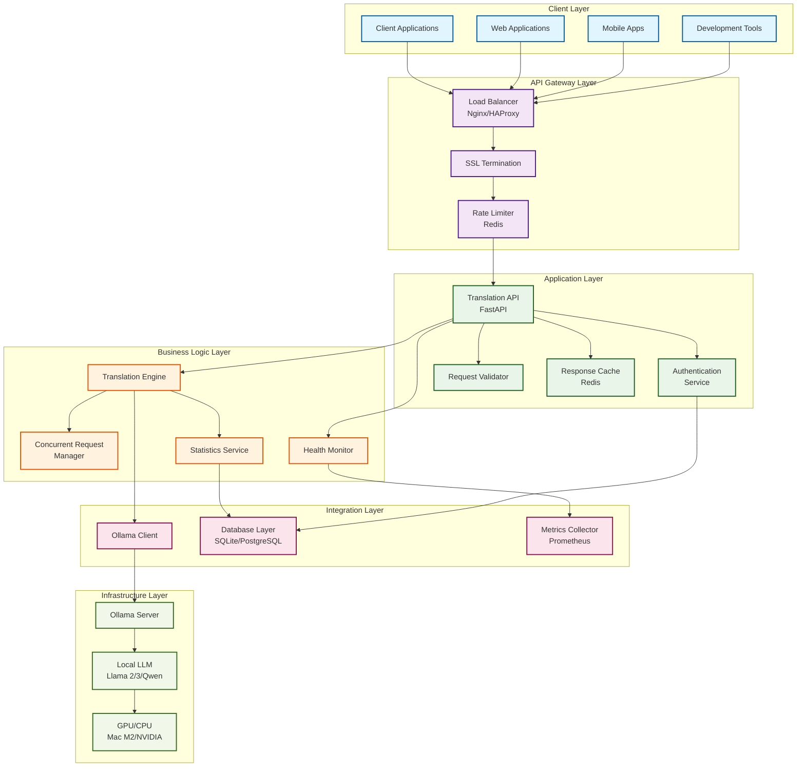

# LLM Translation Service - System Architecture

```mermaid
flowchart TB
    subgraph "Client Layer"
        CA[Client Applications]
        WA[Web Applications] 
        MA[Mobile Apps]
        DEV[Development Tools]
    end

    subgraph "API Gateway Layer"
        LB[Load Balancer<br/>Nginx/HAProxy]
        RL[Rate Limiter<br/>Redis]
        SSL[SSL Termination]
    end

    subgraph "Application Layer"
        API[Translation API<br/>FastAPI]
        AUTH[Authentication<br/>Service]
        VAL[Request Validator]
        CACHE[Response Cache<br/>Redis]
    end

    subgraph "Business Logic Layer"
        TE[Translation Engine]
        CONC[Concurrent Request<br/>Manager]
        STATS[Statistics Service]
        HEALTH[Health Monitor]
    end

    subgraph "Integration Layer"
        OC[Ollama Client]
        DB[Database Layer<br/>SQLite/PostgreSQL]
        METRICS[Metrics Collector<br/>Prometheus]
    end

    subgraph "Infrastructure Layer"
        OLLAMA[Ollama Server]
        LLM[Local LLM<br/>Llama 2/3/Qwen]
        GPU[GPU/CPU<br/>Mac M2/NVIDIA]
    end

    %% Client to Gateway
    CA --> LB
    WA --> LB
    MA --> LB
    DEV --> LB

    %% Gateway Layer
    LB --> SSL
    SSL --> RL
    RL --> API

    %% Application Layer
    API --> AUTH
    API --> VAL
    API --> CACHE
    
    %% Business Logic
    API --> TE
    TE --> CONC
    TE --> STATS
    API --> HEALTH

    %% Integration
    TE --> OC
    STATS --> DB
    HEALTH --> METRICS
    AUTH --> DB

    %% Infrastructure
    OC --> OLLAMA
    OLLAMA --> LLM
    LLM --> GPU

    %% Styling
    classDef clientLayer fill:#e1f5fe,stroke:#01579b,stroke-width:2px
    classDef gatewayLayer fill:#f3e5f5,stroke:#4a148c,stroke-width:2px
    classDef appLayer fill:#e8f5e8,stroke:#1b5e20,stroke-width:2px
    classDef businessLayer fill:#fff3e0,stroke:#e65100,stroke-width:2px
    classDef integrationLayer fill:#fce4ec,stroke:#880e4f,stroke-width:2px
    classDef infraLayer fill:#f1f8e9,stroke:#33691e,stroke-width:2px

    class CA,WA,MA,DEV clientLayer
    class LB,RL,SSL gatewayLayer
    class API,AUTH,VAL,CACHE appLayer
    class TE,CONC,STATS,HEALTH businessLayer
    class OC,DB,METRICS integrationLayer
    class OLLAMA,LLM,GPU infraLayer
```
