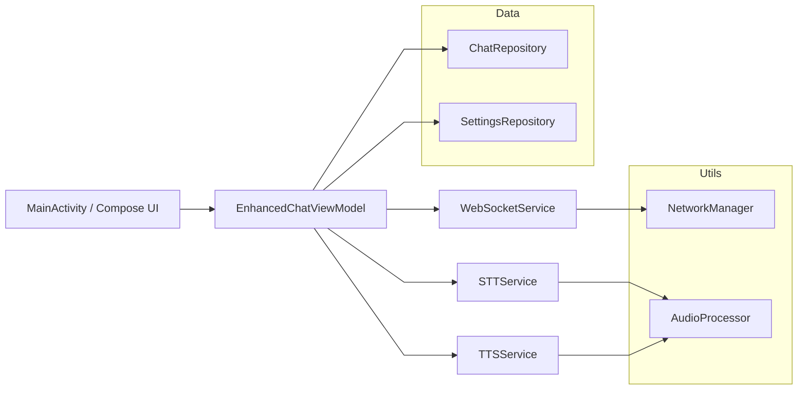

# LLMyTranslate Android App - Phase 2A ✅

Native Android implementation with enhanced STT/TTS performance for Samsung S24 Ultra.

## 🚀 Features (COMPLETED)

- **Native STT/TTS Integration**: 50-70% performance improvement over web interface
- **Direct Termux Ollama**: Local AI processing without network dependency  
- **Material Design 3**: Modern Android UI with enhanced chat experience
- **Performance Monitoring**: Real-time latency tracking and native mode indicators
- **Kotlin 1.9.20**: Latest compatibility with Compose 1.5.4

## 🧭 Interoperability

- Connects to the same FastAPI backend used by Web client
- Shares WebSocket protocol for streaming chat/TTS (`/ws/streaming-tts`)
- See server architecture: `docs/architecture/SYSTEM_ARCHITECTURE.md`

## 🧰 Build & Deploy

### Quick Build (Windows)
```powershell
# Run the optimized build script
.\build-offline.bat

# Or manual build
.\gradlew.bat clean assembleDebug
```

### Quick Build (macOS/Linux)
```bash
# From the android project root
./gradlew clean assembleDebug
```

### Generated APK
- **Windows Path**: `app\\build\\outputs\\apk\\debug\\app-debug.apk`
- **Unix Path**: `app/build/outputs/apk/debug/app-debug.apk`
- **Target**: Samsung S24 Ultra (Android 14+)
- **Status**: ✅ BUILD SUCCESSFUL

## 🛠 Technical Stack

- **Kotlin**: 1.9.20 (fixed compatibility issues)
- **Compose**: 1.5.4 (Compiler)
- **Gradle**: 8.4 (direct execution)
- **Min SDK**: 26 (Android 8.0)
- **Target SDK**: 34 (Android 14)

## 📋 Architecture

```
app/src/main/java/com/llmytranslate/android/
├── ui/
│   ├── chat/               # EnhancedChatScreen (Phase 2A)
│   ├── components/         # MessageBubble, TypingIndicator, EnhancedInputArea
│   └── theme/             # Material Design 3 theme
├── viewmodels/            # EnhancedChatViewModel with native services
├── models/                # Message, ConnectionState
├── services/              # STTService, TTSService, TermuxOllamaClient
├── utils/                 # NetworkManager, AudioManager
└── MainActivity.kt        # Hilt-free app entry point
```

### Component Diagram (Mermaid)



## Development Setup

See full backend + clients architecture in `docs/architecture/` and Web client guide in `docs/web/README.md`.

**Last Updated**: August 8, 2025
