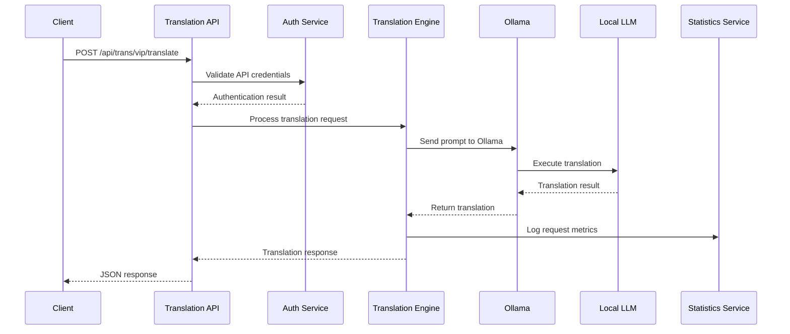

# LLM Translation Service - Software Design Document

## 1. Executive Summary

The LLM Translation Service is a PC-based translation solution that leverages locally deployed Large Language Models (LLMs) to provide Chinese-English bidirectional translation capabilities. The service is designed to be API-compatible with Baidu Translate API, enabling seamless integration into existing applications while maintaining data privacy through local processing.

## 2. System Overview

### 2.1 Purpose
Provide a high-performance, locally-hosted translation service that can handle concurrent requests efficiently while maintaining compatibility with popular translation APIs.

### 2.2 Scope
- Local LLM deployment via Ollama
- RESTful API service
- Chinese ↔ English translation
- Request statistics and monitoring
- Concurrent request handling
- Baidu Translate API compatibility

## 3. Requirements Analysis

### 3.1 Functional Requirements
- **F1**: Deploy LLM locally using Ollama framework
- **F2**: Support Chinese to English and English to Chinese translation
- **F3**: Provide RESTful API interface compatible with Baidu Translate API
- **F4**: Handle concurrent translation requests efficiently
- **F5**: Maintain translation statistics (requests, success/failure rates, token usage)
- **F6**: Support both local and remote API access
- **F7**: Stateless operation (no content persistence)

### 3.2 Non-Functional Requirements
- **NF1**: **Performance**: Handle multiple concurrent requests efficiently
- **NF2**: **Compatibility**: Support Mac M2 and NVIDIA GPU (Quadro P2000+)
- **NF3**: **Scalability**: Horizontal scaling capability
- **NF4**: **Reliability**: High availability and error handling
- **NF5**: **Security**: API authentication and rate limiting
- **NF6**: **Monitoring**: Comprehensive metrics and logging

### 3.3 Technical Constraints
- Local deployment on Mac M2 or NVIDIA GPU systems
- Ollama as LLM interface
- API compatibility with Baidu Translate

## 4. System Architecture

### 4.1 High-Level Architecture

```
┌─────────────────┐    ┌─────────────────┐    ┌─────────────────┐
│   Client Apps   │    │   Web Browser   │    │  Mobile Apps    │
└─────────┬───────┘    └─────────┬───────┘    └─────────┬───────┘
          │                      │                      │
          └──────────────────────┼──────────────────────┘
                                 │
                    ┌─────────────┴─────────────┐
                    │     Load Balancer         │
                    │   (Nginx/HAProxy)         │
                    └─────────────┬─────────────┘
                                  │
                    ┌─────────────┴─────────────┐
                    │   Translation API         │
                    │   (FastAPI/Flask)         │
                    └─────────────┬─────────────┘
                                  │
          ┌───────────────────────┼───────────────────────┐
          │                       │                       │
┌─────────┴─────────┐   ┌─────────┴─────────┐   ┌─────────┴─────────┐
│   Auth Service    │   │  Translation      │   │   Statistics      │
│                   │   │   Engine          │   │   Service         │
└───────────────────┘   └─────────┬─────────┘   └───────────────────┘
                                  │
                        ┌─────────┴─────────┐
                        │   Ollama LLM      │
                        │   Interface       │
                        └─────────┬─────────┘
                                  │
                        ┌─────────┴─────────┐
                        │   Local LLM       │
                        │ (e.g., Llama 2/3) │
                        └───────────────────┘
```

### 4.2 Component Architecture

#### 4.2.1 API Gateway Layer
- **Load Balancer**: Nginx/HAProxy for request distribution
- **Rate Limiting**: Redis-based rate limiting
- **SSL Termination**: HTTPS support

#### 4.2.2 Application Layer
- **Translation API**: FastAPI-based REST service
- **Authentication Service**: JWT-based authentication
- **Request Validator**: Input validation and sanitization

#### 4.2.3 Business Logic Layer
- **Translation Engine**: Core translation logic
- **Statistics Service**: Metrics collection and reporting
- **Concurrent Request Manager**: Async request handling

#### 4.2.4 Integration Layer
- **Ollama Client**: LLM communication interface
- **Monitoring Service**: Health checks and metrics

#### 4.2.5 Infrastructure Layer
- **Local LLM**: Ollama-managed language model
- **Redis Cache**: Session and rate limiting storage
- **SQLite/PostgreSQL**: Statistics and configuration storage

## 5. API Design

### 5.1 Baidu Translate API Compatibility

#### 5.1.1 Translation Endpoint
```http
POST /api/trans/vip/translate
Content-Type: application/x-www-form-urlencoded

q=hello world&from=en&to=zh&appid=<app_id>&salt=<salt>&sign=<signature>
```

#### 5.1.2 Response Format
```json
{
    "from": "en",
    "to": "zh",
    "trans_result": [
        {
            "src": "hello world",
            "dst": "你好世界"
        }
    ]
}
```

### 5.2 Extended API Endpoints

#### 5.2.1 Health Check
```http
GET /api/health
```

#### 5.2.2 Statistics
```http
GET /api/stats
Authorization: Bearer <token>
```

#### 5.2.3 Supported Languages
```http
GET /api/languages
```

## 6. Data Flow

### 6.1 Translation Request Flow



## 7. Technology Stack

### 7.1 Backend Technologies
- **Framework**: FastAPI (Python)
- **LLM Interface**: Ollama
- **Database**: SQLite (development) / PostgreSQL (production)
- **Cache**: Redis
- **Web Server**: Uvicorn + Nginx
- **Monitoring**: Prometheus + Grafana

### 7.2 Infrastructure
- **Containerization**: Docker
- **Orchestration**: Docker Compose
- **Load Balancing**: Nginx
- **SSL/TLS**: Let's Encrypt

### 7.3 Development Tools
- **Language**: Python 3.11+
- **Package Management**: Poetry/pip
- **Testing**: pytest
- **Code Quality**: Black, flake8, mypy
- **CI/CD**: GitHub Actions

## 8. Performance Considerations

### 8.1 Concurrent Request Handling
- Async/await patterns for I/O operations
- Connection pooling for Ollama client
- Request queuing with priority handling

### 8.2 Caching Strategy
- Redis-based response caching for identical requests
- LRU cache for frequently translated phrases
- Model warming to reduce cold start latency

### 8.3 Resource Management
- GPU memory management for NVIDIA cards
- CPU optimization for Mac M2
- Graceful degradation under high load

## 9. Security

### 9.1 Authentication
- API key-based authentication (Baidu compatible)
- JWT tokens for extended features
- Rate limiting per API key

### 9.2 Data Protection
- No persistent storage of translation content
- Input sanitization and validation
- HTTPS encryption for all communications

## 10. Monitoring and Observability

### 10.1 Metrics
- Request count and response times
- Success/failure rates
- Token usage statistics
- System resource utilization

### 10.2 Logging
- Structured JSON logging
- Request/response logging (without content)
- Error tracking and alerting

## 11. Deployment Strategy

### 11.1 Local Development
- Docker Compose for all services
- Ollama running natively or in container
- Development database (SQLite)

### 11.2 Production Deployment
- Multi-container deployment
- Nginx reverse proxy
- Production database (PostgreSQL)
- Monitoring stack

## 12. Testing Strategy

### 12.1 Unit Testing
- API endpoint testing
- Translation engine testing
- Statistics service testing

### 12.2 Integration Testing
- End-to-end API testing
- Ollama integration testing
- Database integration testing

### 12.3 Performance Testing
- Load testing with various concurrency levels
- Memory and GPU utilization testing
- Response time benchmarking

## 13. Future Enhancements

- Support for additional language pairs
- Custom model fine-tuning capabilities
- Web-based management interface
- Advanced caching strategies
- Multi-node clustering support
