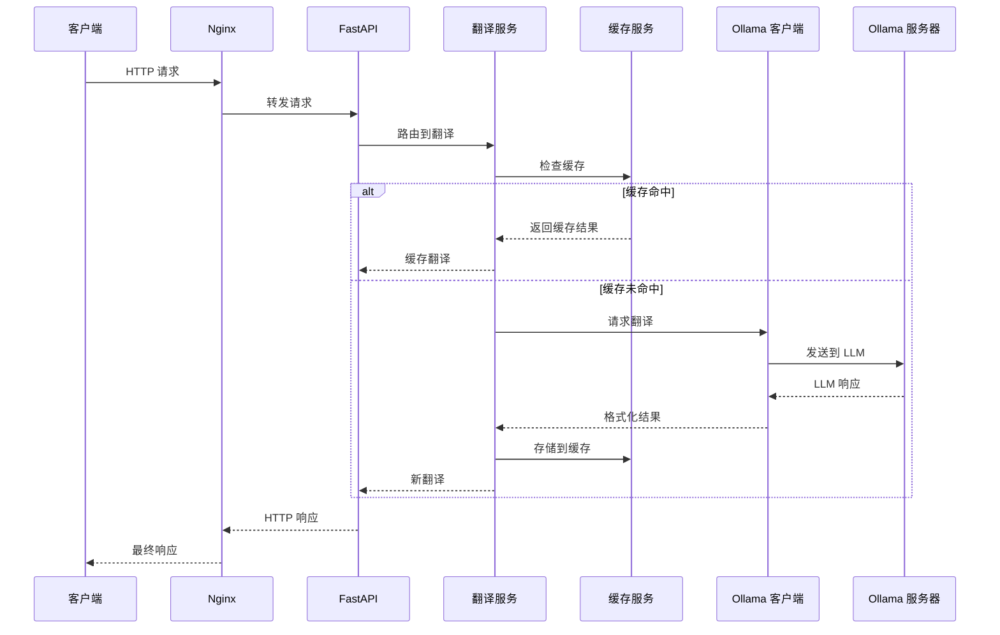
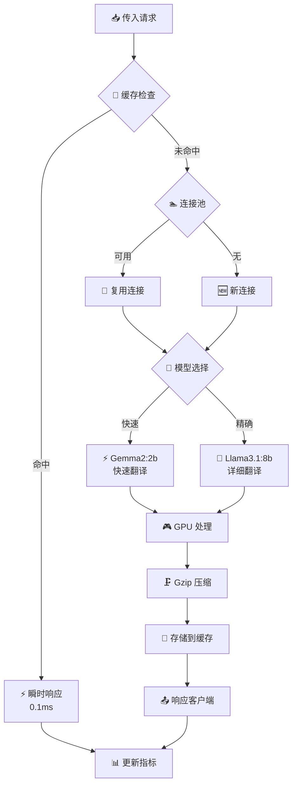
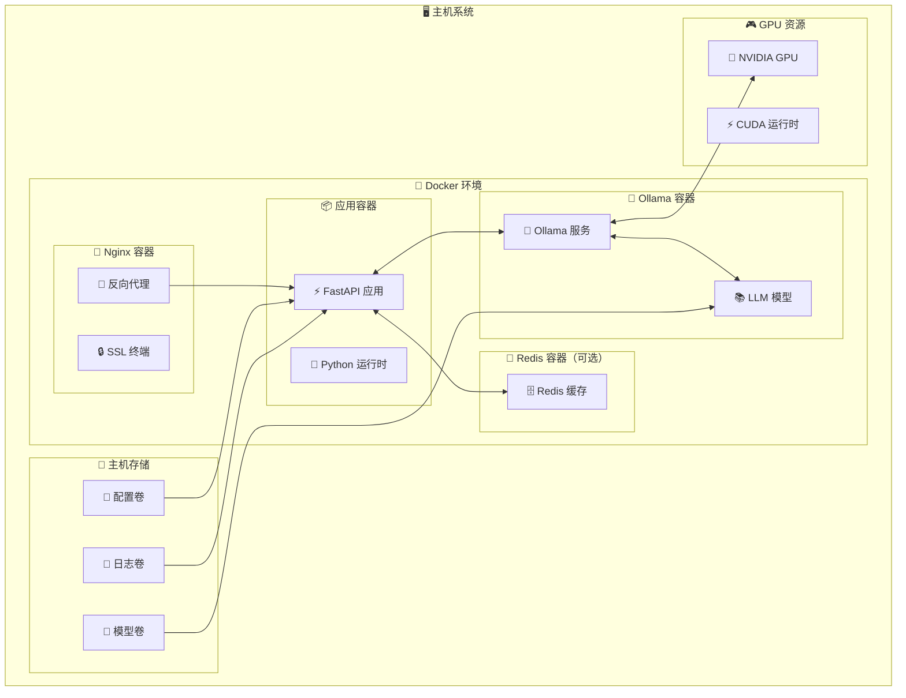

# LLM 翻译服务 - 软件栈流程图

## 系统架构概览

```mermaid
graph TB
    %% 外部客户端
    Client[👤 客户端应用]
    SystemDesign[🖥️ SystemDesign]
    Browser[🌐 Web 浏览器]
    
    %% 网络层
    subgraph "🌍 网络层"
        Internet[🌐 互联网]
        Ngrok[🚇 Ngrok 隧道]
        Router[🏠 本地网络/路由器]
    end
    
    %% 反向代理
    subgraph "🔀 反向代理层"
        Nginx[🔧 Nginx<br/>负载均衡 & SSL]
    end
    
    %% 主应用程序
    subgraph "🚀 FastAPI 应用层"
        FastAPI[⚡ FastAPI 服务器<br/>端口 8000]
        
        subgraph "🛣️ API 路由"
            HealthAPI[🏥 健康检查<br/>/api/health]
            TransAPI[🔄 翻译 API<br/>/api/translate]
            BaiduAPI[📘 百度兼容<br/>/api/trans/vip/translate]
            StatsAPI[📊 统计<br/>/api/stats]
            DiscoveryAPI[🔍 发现<br/>/api/discovery]
            AdminAPI[⚙️ 管理<br/>/api/admin]
        end
        
        subgraph "🔧 核心服务"
            TransService[🔄 翻译服务<br/>translation_service.py]
            AuthService[🔐 认证服务<br/>auth_service.py]
            CacheService[💾 缓存服务<br/>cache_service.py]
            StatsService[📊 统计服务<br/>stats_service.py]
            NetworkService[🌐 网络服务<br/>network.py]
        end
        
        subgraph "📊 模型 & 模式"
            Schemas[📋 Pydantic 模式<br/>schemas.py]
            Config[⚙️ 配置<br/>config.py]
        end
    end
    
    %% LLM 层
    subgraph "🧠 LLM 处理层"
        OllamaClient[🤖 Ollama 客户端<br/>ollama_client.py]
        
        subgraph "🔄 连接池"
            HTTPPool[🏊 HTTP 连接池<br/>Keep-Alive 连接]
        end
        
        subgraph "🎯 模型选择"
            ModelSelector[🎯 智能模型选择器]
            Gemma[⚡ Gemma2:2b<br/>快速翻译]
            Llama[🎯 Llama3.1:8b<br/>精确翻译]
        end
    end
    
    %% Ollama 服务
    subgraph "🤖 Ollama 服务"
        OllamaServer[🦙 Ollama 服务器<br/>端口 11434]
        ModelManager[📦 模型管理器]
        GPUAccel[🎮 GPU 加速<br/>NVIDIA Quadro P2000]
    end
    
    %% 缓存层
    subgraph "💾 缓存 & 性能"
        LRUCache[🗂️ LRU 缓存<br/>内存中]
        GzipComp[🗜️ Gzip 压缩]
        CacheStats[📈 缓存统计]
        PerfMetrics[⚡ 性能指标]
    end
    
    %% 存储层
    subgraph "💽 存储层"
        ConfigFiles[📁 配置文件<br/>.env, nginx.conf]
        LogFiles[📝 日志文件<br/>logs/]
        CacheDB[💾 持久缓存<br/>可选 Redis]
    end
    
    %% 部署 & 管理
    subgraph "🐳 部署层"
        Docker[🐳 Docker 容器]
        DockerCompose[🎼 Docker Compose<br/>多服务编排]
        
        subgraph "📦 容器服务"
            AppContainer[📦 应用容器<br/>Python + FastAPI]
            OllamaContainer[🦙 Ollama 容器<br/>LLM 模型]
            NginxContainer[🔧 Nginx 容器<br/>反向代理]
            RedisContainer[💾 Redis 容器<br/>可选缓存]
        end
    end
    
    %% 自动化 & 脚本
    subgraph "🔧 自动化 & 管理"
        subgraph "💻 PowerShell 脚本"
            SetupPS1[🔧 setup.ps1<br/>环境设置]
            StartPS1[▶️ start-service.ps1<br/>服务启动器]
            StopPS1[⏹️ stop-service.ps1<br/>服务停止器]
            DeployPS1[🚀 deploy-online.ps1<br/>云部署]
            ServiceMgrPS1[⚙️ service-manager.ps1<br/>服务管理]
        end
        
        subgraph "🐧 Shell 脚本"
            SetupSH[🔧 setup.sh<br/>Unix 设置]
            StartSH[▶️ start-service.sh<br/>Unix 启动器]
            StopSH[⏹️ stop-service.sh<br/>Unix 停止器]
            DeploySH[🚀 deploy-online.sh<br/>Unix 部署]
        end
        
        subgraph "🔍 实用工具"
            Validator[✅ validate.py<br/>健康验证器]
            Discovery[🔍 discover_service.py<br/>服务发现]
            TestConnectivity[🔗 test_ollama_connectivity.py<br/>连接测试]
        end
    end
    
    %% 测试层
    subgraph "🧪 测试 & 质量"
        subgraph "📋 测试类型"
            UnitTests[🔬 单元测试<br/>tests/unit/]
            IntegrationTests[🔗 集成测试<br/>tests/integration/]
            PerformanceTests[⚡ 性能测试<br/>performance/]
            ExampleTests[📝 示例测试<br/>tests/examples/]
        end
        
        subgraph "🎯 测试目标"
            BaiduCompat[📘 百度 API 兼容性]
            OllamaTest[🦙 Ollama 集成]
            CacheTest[💾 缓存性能]
            AuthTest[🔐 身份验证]
        end
    end
    
    %% 数据流连接
    Client --> Internet
    SystemDesign --> Router
    Browser --> Internet
    
    Internet --> Ngrok
    Router --> Nginx
    Ngrok --> Nginx
    
    Nginx --> FastAPI
    
    FastAPI --> HealthAPI
    FastAPI --> TransAPI
    FastAPI --> BaiduAPI
    FastAPI --> StatsAPI
    FastAPI --> DiscoveryAPI
    FastAPI --> AdminAPI
    
    TransAPI --> TransService
    BaiduAPI --> TransService
    TransAPI --> AuthService
    BaiduAPI --> AuthService
    
    TransService --> CacheService
    TransService --> OllamaClient
    CacheService --> LRUCache
    LRUCache --> GzipComp
    
    OllamaClient --> HTTPPool
    HTTPPool --> ModelSelector
    ModelSelector --> Gemma
    ModelSelector --> Llama
    
    Gemma --> OllamaServer
    Llama --> OllamaServer
    OllamaServer --> ModelManager
    OllamaServer --> GPUAccel
    
    StatsService --> PerfMetrics
    StatsService --> CacheStats
    
    Config --> ConfigFiles
    FastAPI --> LogFiles
    
    %% 部署连接
    Docker --> DockerCompose
    DockerCompose --> AppContainer
    DockerCompose --> OllamaContainer
    DockerCompose --> NginxContainer
    DockerCompose --> RedisContainer
    
    %% 管理连接
    SetupPS1 --> Docker
    StartPS1 --> FastAPI
    StartPS1 --> OllamaServer
    StopPS1 --> FastAPI
    DeployPS1 --> DockerCompose
    
    %% 验证连接
    Validator --> HealthAPI
    Discovery --> DiscoveryAPI
    TestConnectivity --> OllamaServer
    
    %% 测试连接
    UnitTests --> TransService
    IntegrationTests --> FastAPI
    PerformanceTests --> TransAPI
    BaiduCompat --> BaiduAPI
    
    %% 样式
    classDef clientLayer fill:#e1f5fe,stroke:#01579b,stroke-width:2px
    classDef networkLayer fill:#f3e5f5,stroke:#4a148c,stroke-width:2px
    classDef appLayer fill:#e8f5e8,stroke:#1b5e20,stroke-width:2px
    classDef llmLayer fill:#fff3e0,stroke:#e65100,stroke-width:2px
    classDef cacheLayer fill:#fce4ec,stroke:#880e4f,stroke-width:2px
    classDef deployLayer fill:#e3f2fd,stroke:#0d47a1,stroke-width:2px
    classDef scriptLayer fill:#f1f8e9,stroke:#33691e,stroke-width:2px
    classDef testLayer fill:#fcf8e3,stroke:#f57f17,stroke-width:2px
    
    class Client,SystemDesign,Browser clientLayer
    class Internet,Ngrok,Router,Nginx networkLayer
    class FastAPI,HealthAPI,TransAPI,BaiduAPI,StatsAPI,DiscoveryAPI,AdminAPI,TransService,AuthService,CacheService,StatsService,NetworkService,Schemas,Config appLayer
    class OllamaClient,HTTPPool,ModelSelector,Gemma,Llama,OllamaServer,ModelManager,GPUAccel llmLayer
    class LRUCache,GzipComp,CacheStats,PerfMetrics,ConfigFiles,LogFiles,CacheDB cacheLayer
    class Docker,DockerCompose,AppContainer,OllamaContainer,NginxContainer,RedisContainer deployLayer
    class SetupPS1,StartPS1,StopPS1,DeployPS1,ServiceMgrPS1,SetupSH,StartSH,StopSH,DeploySH,Validator,Discovery,TestConnectivity scriptLayer
    class UnitTests,IntegrationTests,PerformanceTests,ExampleTests,BaiduCompat,OllamaTest,CacheTest,AuthTest testLayer
```

## 组件交互流程

### 1. 🔄 请求处理流程

### 2. ⚡ 性能优化流程

### 3. 🐳 部署架构

## 技术栈总结

### 🔧 **核心技术**
- **后端框架**: FastAPI (Python 3.11+)
- **LLM 引擎**: Ollama (本地 LLM 管理)
- **Web 服务器**: Nginx (反向代理)
- **容器化**: Docker + Docker Compose
- **模型**: Gemma2:2b, Llama3.1:8b

### ⚡ **性能层**
- **缓存**: LRU 缓存 + Gzip 压缩
- **连接管理**: HTTP 连接池
- **GPU 加速**: NVIDIA CUDA 支持
- **异步处理**: FastAPI Async/Await

### 🌐 **网络 & 访问**
- **远程访问**: Ngrok 隧道
- **负载均衡**: Nginx 反向代理
- **API 兼容性**: 百度翻译 API
- **服务发现**: 自动检测协议

### 🔧 **自动化 & 管理**
- **跨平台脚本**: PowerShell + Shell + Batch
- **服务管理**: 启动/停止/部署脚本
- **健康监控**: 验证 & 连接测试
- **性能监控**: 实时指标

### 🧪 **质量保证**
- **测试框架**: PyTest
- **测试覆盖**: 单元 + 集成 + 性能
- **API 测试**: 百度兼容性测试
- **验证**: 服务健康检查

此流程图提供了整个软件栈的全面视图，显示每个组件如何与其他组件交互以及从客户端请求到响应的完整数据流。
