# LLM Translation Service - Software Stack Flowchart

## System Architecture Overview

```mermaid
graph TB
    %% External Clients
    Client[👤 Client Applications]
    SystemDesign[🖥️ SystemDesign]
    Browser[🌐 Web Browser]
    
    %% Network Layer
    subgraph "🌍 Network Layer"
        Internet[🌐 Internet]
        Ngrok[🚇 Ngrok Tunnel]
        Router[🏠 Local Network/Router]
    end
    
    %% Reverse Proxy
    subgraph "🔀 Reverse Proxy Layer"
        Nginx[🔧 Nginx<br/>Load Balancer & SSL]
    end
    
    %% Main Application
    subgraph "🚀 FastAPI Application Layer"
        FastAPI[⚡ FastAPI Server<br/>Port 8000]
        
        subgraph "🛣️ API Routes"
            HealthAPI[🏥 Health Check<br/>/api/health]
            TransAPI[🔄 Translation API<br/>/api/translate]
            BaiduAPI[📘 Baidu Compatible<br/>/api/trans/vip/translate]
            StatsAPI[📊 Statistics<br/>/api/stats]
            DiscoveryAPI[🔍 Discovery<br/>/api/discovery]
            AdminAPI[⚙️ Admin<br/>/api/admin]
        end
        
        subgraph "🔧 Core Services"
            TransService[🔄 Translation Service<br/>translation_service.py]
            AuthService[🔐 Auth Service<br/>auth_service.py]
            CacheService[💾 Cache Service<br/>cache_service.py]
            StatsService[📊 Stats Service<br/>stats_service.py]
            NetworkService[🌐 Network Service<br/>network.py]
        end
        
        subgraph "📊 Models & Schemas"
            Schemas[📋 Pydantic Schemas<br/>schemas.py]
            Config[⚙️ Configuration<br/>config.py]
        end
    end
    
    %% LLM Layer
    subgraph "🧠 LLM Processing Layer"
        OllamaClient[🤖 Ollama Client<br/>ollama_client.py]
        
        subgraph "🔄 Connection Pool"
            HTTPPool[🏊 HTTP Connection Pool<br/>Keep-Alive Connections]
        end
        
        subgraph "🎯 Model Selection"
            ModelSelector[🎯 Smart Model Selector]
            Gemma[⚡ Gemma2:2b<br/>Fast Translation]
            Llama[🎯 Llama3.1:8b<br/>Accurate Translation]
        end
    end
    
    %% Ollama Service
    subgraph "🤖 Ollama Service"
        OllamaServer[🦙 Ollama Server<br/>Port 11434]
        ModelManager[📦 Model Manager]
        GPUAccel[🎮 GPU Acceleration<br/>NVIDIA Quadro P2000]
    end
    
    %% Caching Layer
    subgraph "💾 Caching & Performance"
        LRUCache[🗂️ LRU Cache<br/>In-Memory]
        GzipComp[🗜️ Gzip Compression]
        CacheStats[📈 Cache Statistics]
        PerfMetrics[⚡ Performance Metrics]
    end
    
    %% Storage Layer
    subgraph "💽 Storage Layer"
        ConfigFiles[📁 Config Files<br/>.env, nginx.conf]
        LogFiles[📝 Log Files<br/>logs/]
        CacheDB[💾 Persistent Cache<br/>Optional Redis]
    end
    
    %% Deployment & Management
    subgraph "🐳 Deployment Layer"
        Docker[🐳 Docker Containers]
        DockerCompose[🎼 Docker Compose<br/>Multi-Service Orchestration]
        
        subgraph "📦 Container Services"
            AppContainer[📦 App Container<br/>Python + FastAPI]
            OllamaContainer[🦙 Ollama Container<br/>LLM Models]
            NginxContainer[🔧 Nginx Container<br/>Reverse Proxy]
            RedisContainer[💾 Redis Container<br/>Optional Caching]
        end
    end
    
    %% Automation & Scripts
    subgraph "🔧 Automation & Management"
        subgraph "💻 PowerShell Scripts"
            SetupPS1[🔧 setup.ps1<br/>Environment Setup]
            StartPS1[▶️ start-service.ps1<br/>Service Launcher]
            StopPS1[⏹️ stop-service.ps1<br/>Service Stopper]
            DeployPS1[🚀 deploy-online.ps1<br/>Cloud Deployment]
            ServiceMgrPS1[⚙️ service-manager.ps1<br/>Service Management]
        end
        
        subgraph "🐧 Shell Scripts"
            SetupSH[🔧 setup.sh<br/>Unix Setup]
            StartSH[▶️ start-service.sh<br/>Unix Launcher]
            StopSH[⏹️ stop-service.sh<br/>Unix Stopper]
            DeploySH[🚀 deploy-online.sh<br/>Unix Deployment]
        end
        
        subgraph "🔍 Utilities"
            Validator[✅ validate.py<br/>Health Validator]
            Discovery[🔍 discover_service.py<br/>Service Discovery]
            TestConnectivity[🔗 test_ollama_connectivity.py<br/>Connectivity Tests]
        end
    end
    
    %% Testing Layer
    subgraph "🧪 Testing & Quality"
        subgraph "📋 Test Types"
            UnitTests[🔬 Unit Tests<br/>tests/unit/]
            IntegrationTests[🔗 Integration Tests<br/>tests/integration/]
            PerformanceTests[⚡ Performance Tests<br/>performance/]
            ExampleTests[📝 Example Tests<br/>tests/examples/]
        end
        
        subgraph "🎯 Test Targets"
            BaiduCompat[📘 Baidu API Compatibility]
            OllamaTest[🦙 Ollama Integration]
            CacheTest[💾 Cache Performance]
            AuthTest[🔐 Authentication]
        end
    end
    
    %% Data Flow Connections
    Client --> Internet
    SystemDesign --> Router
    Browser --> Internet
    
    Internet --> Ngrok
    Router --> Nginx
    Ngrok --> Nginx
    
    Nginx --> FastAPI
    
    FastAPI --> HealthAPI
    FastAPI --> TransAPI
    FastAPI --> BaiduAPI
    FastAPI --> StatsAPI
    FastAPI --> DiscoveryAPI
    FastAPI --> AdminAPI
    
    TransAPI --> TransService
    BaiduAPI --> TransService
    TransAPI --> AuthService
    BaiduAPI --> AuthService
    
    TransService --> CacheService
    TransService --> OllamaClient
    CacheService --> LRUCache
    LRUCache --> GzipComp
    
    OllamaClient --> HTTPPool
    HTTPPool --> ModelSelector
    ModelSelector --> Gemma
    ModelSelector --> Llama
    
    Gemma --> OllamaServer
    Llama --> OllamaServer
    OllamaServer --> ModelManager
    OllamaServer --> GPUAccel
    
    StatsService --> PerfMetrics
    StatsService --> CacheStats
    
    Config --> ConfigFiles
    FastAPI --> LogFiles
    
    %% Deployment Connections
    Docker --> DockerCompose
    DockerCompose --> AppContainer
    DockerCompose --> OllamaContainer
    DockerCompose --> NginxContainer
    DockerCompose --> RedisContainer
    
    %% Management Connections
    SetupPS1 --> Docker
    StartPS1 --> FastAPI
    StartPS1 --> OllamaServer
    StopPS1 --> FastAPI
    DeployPS1 --> DockerCompose
    
    %% Validation Connections
    Validator --> HealthAPI
    Discovery --> DiscoveryAPI
    TestConnectivity --> OllamaServer
    
    %% Testing Connections
    UnitTests --> TransService
    IntegrationTests --> FastAPI
    PerformanceTests --> TransAPI
    BaiduCompat --> BaiduAPI
    
    %% Styling
    classDef clientLayer fill:#e1f5fe,stroke:#01579b,stroke-width:2px
    classDef networkLayer fill:#f3e5f5,stroke:#4a148c,stroke-width:2px
    classDef appLayer fill:#e8f5e8,stroke:#1b5e20,stroke-width:2px
    classDef llmLayer fill:#fff3e0,stroke:#e65100,stroke-width:2px
    classDef cacheLayer fill:#fce4ec,stroke:#880e4f,stroke-width:2px
    classDef deployLayer fill:#e3f2fd,stroke:#0d47a1,stroke-width:2px
    classDef scriptLayer fill:#f1f8e9,stroke:#33691e,stroke-width:2px
    classDef testLayer fill:#fcf8e3,stroke:#f57f17,stroke-width:2px
    
    class Client,SystemDesign,Browser clientLayer
    class Internet,Ngrok,Router,Nginx networkLayer
    class FastAPI,HealthAPI,TransAPI,BaiduAPI,StatsAPI,DiscoveryAPI,AdminAPI,TransService,AuthService,CacheService,StatsService,NetworkService,Schemas,Config appLayer
    class OllamaClient,HTTPPool,ModelSelector,Gemma,Llama,OllamaServer,ModelManager,GPUAccel llmLayer
    class LRUCache,GzipComp,CacheStats,PerfMetrics,ConfigFiles,LogFiles,CacheDB cacheLayer
    class Docker,DockerCompose,AppContainer,OllamaContainer,NginxContainer,RedisContainer deployLayer
    class SetupPS1,StartPS1,StopPS1,DeployPS1,ServiceMgrPS1,SetupSH,StartSH,StopSH,DeploySH,Validator,Discovery,TestConnectivity scriptLayer
    class UnitTests,IntegrationTests,PerformanceTests,ExampleTests,BaiduCompat,OllamaTest,CacheTest,AuthTest testLayer
```

## Component Interaction Flow

### 1. 🔄 Request Processing Flow

### 2. ⚡ Performance Optimization Flow

```mermaid
flowchart TD
    Request[📥 Incoming Request] --> CacheCheck{💾 Cache Check}
    
    CacheCheck -->|Hit| InstantResponse[⚡ Instant Response<br/>0.1ms]
    CacheCheck -->|Miss| ConnectionPool{🏊 Connection Pool}
    
    ConnectionPool -->|Available| ReuseConnection[🔄 Reuse Connection]
    ConnectionPool -->|None| NewConnection[🆕 New Connection]
    
    ReuseConnection --> ModelSelection{🎯 Model Selection}
    NewConnection --> ModelSelection
    
    ModelSelection -->|Fast| Gemma[⚡ Gemma2:2b<br/>Quick Translation]
    ModelSelection -->|Accurate| Llama[🎯 Llama3.1:8b<br/>Detailed Translation]
    
    Gemma --> GPUProcess[🎮 GPU Processing]
    Llama --> GPUProcess
    
    GPUProcess --> Compression[🗜️ Gzip Compression]
    Compression --> CacheStore[💾 Store in Cache]
    CacheStore --> Response[📤 Response to Client]
    
    InstantResponse --> Metrics[📊 Update Metrics]
    Response --> Metrics
```

### 3. 🐳 Deployment Architecture

```mermaid
graph TB
    subgraph "🖥️ Host System"
        subgraph "🐳 Docker Environment"
            subgraph "📦 App Container"
                FastAPI[⚡ FastAPI Application]
                Python[🐍 Python Runtime]
            end
            
            subgraph "🦙 Ollama Container"
                OllamaService[🤖 Ollama Service]
                Models[📚 LLM Models]
            end
            
            subgraph "🔧 Nginx Container"
                ProxyServer[🔀 Reverse Proxy]
                SSL[🔒 SSL Termination]
            end
            
            subgraph "💾 Redis Container (Optional)"
                RedisCache[🗄️ Redis Cache]
            end
        end
        
        subgraph "💽 Host Storage"
            ConfigVol[📁 Config Volume]
            LogVol[📝 Logs Volume]
            ModelVol[🧠 Models Volume]
        end
        
        subgraph "🎮 GPU Resources"
            NVIDIA[🎯 NVIDIA GPU]
            CUDA[⚡ CUDA Runtime]
        end
    end
    
    %% Connections
    FastAPI <--> OllamaService
    ProxyServer --> FastAPI
    FastAPI <--> RedisCache
    OllamaService <--> Models
    OllamaService <--> NVIDIA
    
    ConfigVol --> FastAPI
    LogVol --> FastAPI
    ModelVol --> Models
```

## Technology Stack Summary

### 🔧 **Core Technologies**
- **Backend Framework**: FastAPI (Python 3.11+)
- **LLM Engine**: Ollama (Local LLM Management)
- **Web Server**: Nginx (Reverse Proxy)
- **Containerization**: Docker + Docker Compose
- **Models**: Gemma2:2b, Llama3.1:8b

### ⚡ **Performance Layer**
- **Caching**: LRU Cache + Gzip Compression
- **Connection Management**: HTTP Connection Pooling
- **GPU Acceleration**: NVIDIA CUDA Support
- **Async Processing**: FastAPI Async/Await

### 🌐 **Network & Access**
- **Remote Access**: Ngrok Tunneling
- **Load Balancing**: Nginx Reverse Proxy
- **API Compatibility**: Baidu Translate API
- **Service Discovery**: Auto-detection Protocol

### 🔧 **Automation & Management**
- **Cross-Platform Scripts**: PowerShell + Shell + Batch
- **Service Management**: Start/Stop/Deploy Scripts
- **Health Monitoring**: Validation & Connectivity Tests
- **Performance Monitoring**: Real-time Metrics

### 🧪 **Quality Assurance**
- **Testing Framework**: PyTest
- **Test Coverage**: Unit + Integration + Performance
- **API Testing**: Baidu Compatibility Tests
- **Validation**: Service Health Checks

This flowchart provides a comprehensive view of the entire software stack, showing how each component interacts with others and the complete data flow from client request to response.
