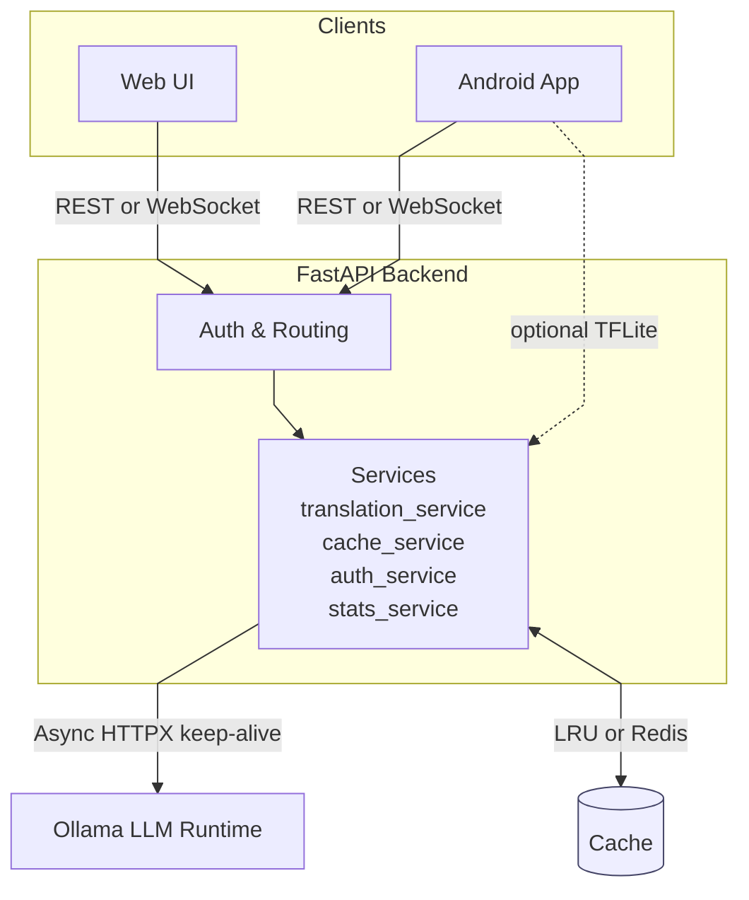
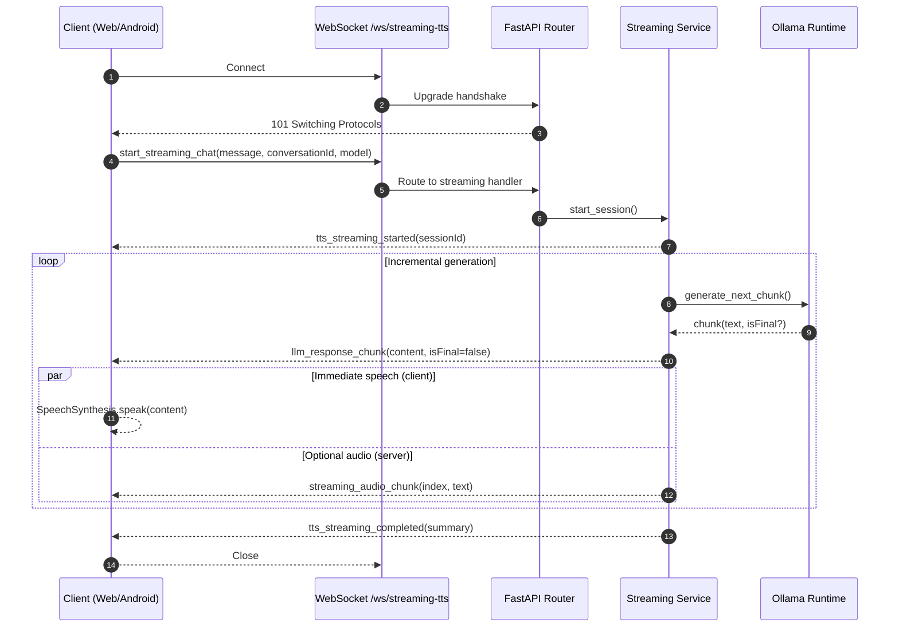

# System Architecture Overview

This document describes the end-to-end architecture of LLMyTranslate across backend services and client applications (Web and Android).

## Components

- FastAPI Backend (Python)
  - REST endpoints: translation, optimized, TTS, health, discovery
  - WebSocket endpoints: streaming chat / streaming TTS (`/ws/streaming-tts`)
  - Services: translation_service, ollama_client, cache_service, auth_service, stats_service
  - Optional Redis cache with in-memory fallback
- Local LLM Runtime (Ollama)
  - Model hosting and inference (Gemma3, Llama3.1, Qwen, etc.)
  - GPU acceleration if available
- On‑device Inference (TensorFlow Lite)
  - Lightweight TFLite runtime with wrappers for TinyLlama (LLM) and SpeechT5 (TTS)
  - Primary target: Android on‑device; also used for local smoke tests
  - Backends: tensorflow.lite or tflite_runtime; NNAPI/XNNPACK delegates on mobile
- Clients
  - Web UI (static HTML/JS under `web/`)
    - Chat UI with streaming TTS (`web/assets/streaming-tts*.js`)
    - Multiple entry pages (chat.html, translate.html, voice-chat.html, etc.)
  - Android App (`android/`)
    - Native STT/TTS
    - WebSocket connection to backend for chat/translation
    - Optional on‑device model execution via TFLite (models stored as app assets)
- Remote Access (optional)
  - Tailscale / Ngrok for external connectivity
- Automation & Scripts
  - Cross-platform start/stop/setup scripts
  - Tests and diagnostics under `tests/` and root scripts

## High-Level Diagram (Mermaid)

## Key Flows

- Translation (REST): client -> /api/trans/vip/translate -> translation_service -> ollama_client -> response
- Optimized Translation: client -> /api/optimized/* -> cache + timing metrics + model selection
- TTS (REST): client -> /api/tts/* -> synthesis -> audio payload (base64)
- Streaming TTS/Chat (WebSocket): client <-> /ws/streaming-tts -> incremental text + TTS playback

### Streaming WebSocket Sequence

### WebSocket Message Types (summary)

- `tts_streaming_started`: `{ session_id }`
- `llm_response_chunk`: `{ content, is_final }`
- `streaming_audio_chunk`: `{ chunk_index, text, is_final }`
- `tts_streaming_completed`: `{ summary }`
- `tts_streaming_error`: `{ error }`

## Deployment

- Local development: `python run.py` with `.env.local`
- Remote mode: Nginx/ngrok/Tailscale with `.env.remote`
- Docker support available in `docker/`
- Android on‑device (optional): TFLite models under app assets (ignored in git),
  invoked via lightweight wrappers; server/web pipeline continues to use Ollama by default.

## Reliability & Performance

- Connection pooling with 100% reuse rate to Ollama
- Smart LRU caching with compression and persistence
- Async I/O in FastAPI + HTTPX
- Health and readiness probes
- Graceful fallbacks when Redis unavailable

## Security

- Baidu-compatible signature validation (configurable)
- Rate limiting (configurable)
- CORS configured for web clients

## Observability

- Structured logging
- Metrics endpoints under optimized API
- Test and diagnostic scripts
