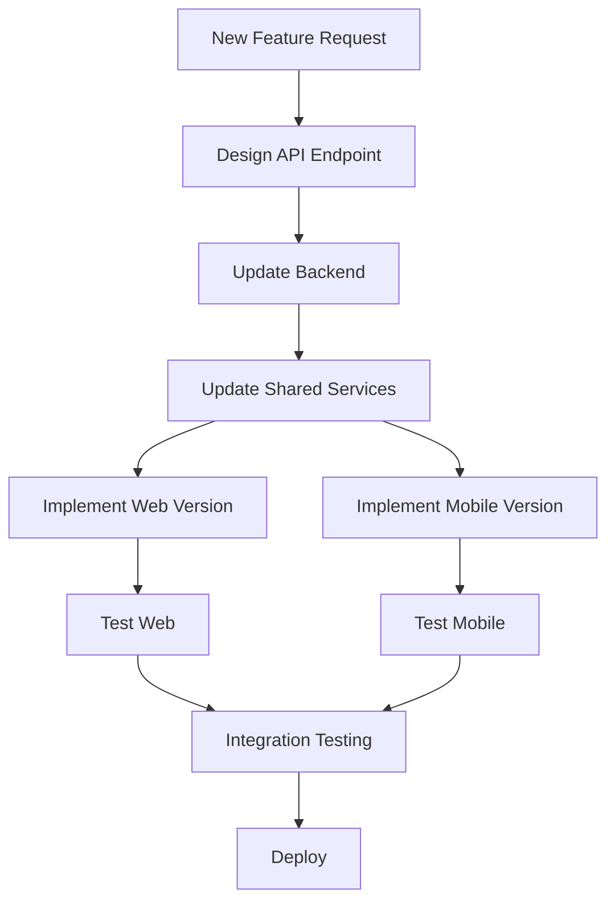

# Cross-Platform Development Synchronization Strategy

## 🔄 Keeping Web and React Native Apps in Perfect Sync

This document outlines a comprehensive strategy to ensure your web application and React Native mobile app remain synchronized throughout development.

## 🏗️ Shared Architecture Approach

### **1. Shared API Service Layer**
Create a unified service layer that both platforms use:

```typescript
// shared/services/ApiService.ts
export class ApiService {
  private baseUrl: string;
  
  constructor(baseUrl: string = 'http://localhost:8000') {
    this.baseUrl = baseUrl;
  }

  // Translation service - identical for both platforms
  async translate(text: string, targetLang: string, sourceLang: string) {
    const response = await fetch(`${this.baseUrl}/api/optimized/translate`, {
      method: 'POST',
      headers: { 'Content-Type': 'application/json' },
      body: JSON.stringify({ text, target_lang: targetLang, source_lang: sourceLang }),
    });
    return response.json();
  }

  // Chat service - identical for both platforms
  async sendChatMessage(message: string, conversationId?: string) {
    const response = await fetch(`${this.baseUrl}/api/chat/message`, {
      method: 'POST',
      headers: { 'Content-Type': 'application/json' },
      body: JSON.stringify({ message, conversation_id: conversationId }),
    });
    return response.json();
  }
}
```

### **2. Shared Configuration and Constants**
```typescript
// shared/config/app-config.ts
export const APP_CONFIG = {
  API_BASE_URL: 'http://localhost:8000',
  SERVICES: {
    TRANSLATE: '/api/optimized/translate',
    CHAT: '/api/chat/message',
    TTS: '/api/tts/synthesize',
    HEALTH: '/api/health'
  },
  LANGUAGES: [
    { code: 'auto', name: 'Auto Detect' },
    { code: 'en', name: 'English' },
    { code: 'es', name: 'Spanish' },
    { code: 'fr', name: 'French' },
    // ... shared language list
  ],
  MODELS: [
    { value: 'gemma3:latest', label: 'Gemma3 (Default)' },
    { value: 'llama3.1:8b', label: 'Llama 3.1 8B' },
    { value: 'llava:latest', label: 'LLaVA (Vision)' },
  ],
  COLORS: {
    gradients: {
      chat: ['#00c6ff', '#0072ff'],
      translate: ['#ff006e', '#8338ec'],
      voice: ['#7209b7', '#2d1b69'],
      phone: ['#ff8a00', '#e52e71'],
    }
  }
};
```

## 📁 Recommended Project Structure

```
llmytranslate/
├── shared/                          # Shared between web and mobile
│   ├── services/
│   │   ├── ApiService.ts           # Unified API service
│   │   └── types.ts                # Shared TypeScript types
│   ├── config/
│   │   ├── app-config.ts           # Shared configuration
│   │   └── constants.ts            # Shared constants
│   ├── utils/
│   │   ├── validation.ts           # Shared validation logic
│   │   └── helpers.ts              # Shared utility functions
│   └── hooks/                      # Shared custom hooks (React)
│       ├── useApi.ts               # Shared API hook
│       └── useTranslation.ts       # Shared translation logic
├── web/                            # Web-specific code
│   ├── assets/
│   ├── components/
│   ├── pages/
│   └── styles/
├── mobile/                         # React Native specific
│   └── LLMyTranslateApp/
│       ├── src/
│       │   ├── screens/
│       │   ├── components/
│       │   └── styles/
│       └── package.json
└── backend/                        # FastAPI backend
    ├── api/
    └── main.py
```

## 🔧 Development Workflow Synchronization

### **1. Feature Development Process**


### **2. Synchronized Development Scripts**
Create package.json scripts that maintain sync:

```json
// Root package.json
{
  "scripts": {
    "dev:all": "concurrently \"npm run dev:backend\" \"npm run dev:web\" \"npm run dev:mobile\"",
    "dev:backend": "cd backend && uvicorn main:app --reload",
    "dev:web": "cd web && python -m http.server 8080",
    "dev:mobile": "cd mobile/LLMyTranslateApp && npm start",
    "test:all": "npm run test:web && npm run test:mobile",
    "build:all": "npm run build:web && npm run build:mobile",
    "sync:services": "cp -r shared/services/* web/js/services/ && cp -r shared/services/* mobile/LLMyTranslateApp/src/services/",
    "sync:config": "cp -r shared/config/* web/js/config/ && cp -r shared/config/* mobile/LLMyTranslateApp/src/config/"
  }
}
```

## 📋 Feature Parity Checklist

### **Before Each Release**
```markdown
- [ ] API endpoints work identically for both platforms
- [ ] UI/UX flows match between web and mobile
- [ ] Color schemes and branding consistent
- [ ] Error handling identical
- [ ] Loading states synchronized
- [ ] Feature flags aligned
- [ ] Performance optimized for both platforms
```

### **Automated Sync Checks**
```typescript
// shared/tests/sync-test.ts
describe('Platform Synchronization', () => {
  test('API responses identical across platforms', async () => {
    const webResponse = await webApiService.translate('hello', 'es');
    const mobileResponse = await mobileApiService.translate('hello', 'es');
    expect(webResponse).toEqual(mobileResponse);
  });

  test('Configuration matches across platforms', () => {
    expect(WEB_CONFIG.LANGUAGES).toEqual(MOBILE_CONFIG.LANGUAGES);
    expect(WEB_CONFIG.MODELS).toEqual(MOBILE_CONFIG.MODELS);
  });
});
```

## 🎨 Design System Synchronization

### **1. Shared Design Tokens**
```typescript
// shared/design/tokens.ts
export const DESIGN_TOKENS = {
  colors: {
    primary: {
      chat: { start: '#00c6ff', end: '#0072ff' },
      translate: { start: '#ff006e', end: '#8338ec' },
      voice: { start: '#7209b7', end: '#2d1b69' },
      phone: { start: '#ff8a00', end: '#e52e71' }
    },
    status: {
      success: '#4CAF50',
      error: '#F44336',
      warning: '#FF9800'
    }
  },
  typography: {
    sizes: {
      title: 24,
      subtitle: 18,
      body: 16,
      caption: 12
    },
    weights: {
      normal: 400,
      bold: 600,
      heavy: 700
    }
  },
  spacing: {
    xs: 4,
    sm: 8,
    md: 16,
    lg: 24,
    xl: 32
  }
};
```

### **2. Platform Adapters**
```typescript
// Web adapter
export const webStyles = {
  gradient: (colors: string[]) => `linear-gradient(135deg, ${colors.join(', ')})`,
  shadow: 'box-shadow: 0 4px 8px rgba(0,0,0,0.1)',
};

// React Native adapter
export const mobileStyles = {
  gradient: (colors: string[]) => ({ colors, start: { x: 0, y: 0 }, end: { x: 1, y: 1 } }),
  shadow: {
    shadowColor: '#000',
    shadowOffset: { width: 0, height: 4 },
    shadowOpacity: 0.1,
    shadowRadius: 8,
    elevation: 4
  }
};
```

## 🔄 Continuous Integration Pipeline

### **GitHub Actions Workflow**
```yaml
# .github/workflows/sync-check.yml
name: Platform Sync Check
on: [push, pull_request]

jobs:
  sync-check:
    runs-on: ubuntu-latest
    steps:
      - uses: actions/checkout@v2
      
      - name: Setup Node.js
        uses: actions/setup-node@v2
        with:
          node-version: '18'
          
      - name: Install dependencies
        run: |
          npm install
          cd mobile/LLMyTranslateApp && npm install
          
      - name: Run sync tests
        run: npm run test:sync
        
      - name: Check API compatibility
        run: npm run test:api-compat
        
      - name: Validate design tokens
        run: npm run test:design-tokens
```

## 📱 Real-time Development Sync

### **1. Live Reload Setup**
```bash
# Terminal 1: Backend
cd backend && uvicorn main:app --reload

# Terminal 2: Web with auto-reload
cd web && python -m http.server 8080

# Terminal 3: React Native with Metro
cd mobile/LLMyTranslateApp && npm start

# Terminal 4: Sync watcher
npm run watch:sync
```

### **2. Automated File Syncing**
```javascript
// scripts/sync-watcher.js
const chokidar = require('chokidar');
const fs = require('fs-extra');

// Watch shared files and sync to both platforms
chokidar.watch('shared/**/*').on('change', (path) => {
  const webDest = path.replace('shared/', 'web/js/');
  const mobileDest = path.replace('shared/', 'mobile/LLMyTranslateApp/src/');
  
  fs.copySync(path, webDest);
  fs.copySync(path, mobileDest);
  
  console.log(`✅ Synced ${path} to both platforms`);
});
```

## 🧪 Testing Strategy for Sync

### **1. Cross-Platform E2E Tests**
```typescript
// tests/cross-platform.test.ts
describe('Cross-Platform Feature Parity', () => {
  test('Translation flow identical on web and mobile', async () => {
    // Test web flow
    const webResult = await testWebTranslation('hello', 'es');
    
    // Test mobile flow  
    const mobileResult = await testMobileTranslation('hello', 'es');
    
    expect(webResult.translatedText).toBe(mobileResult.translatedText);
    expect(webResult.responseTime).toBeLessThan(5000);
    expect(mobileResult.responseTime).toBeLessThan(5000);
  });
});
```

### **2. Visual Regression Testing**
```typescript
// Automated screenshots comparison
test('UI consistency across platforms', async () => {
  const webScreenshot = await captureWebScreenshot('/translate');
  const mobileScreenshot = await captureMobileScreenshot('TranslateScreen');
  
  const similarity = await compareImages(webScreenshot, mobileScreenshot);
  expect(similarity).toBeGreaterThan(0.85); // 85% visual similarity
});
```

## 🚀 Deployment Synchronization

### **Production Deployment Pipeline**
```yaml
# Deploy both platforms simultaneously
deploy:
  runs-on: ubuntu-latest
  steps:
    - name: Deploy Backend
      run: |
        # Deploy FastAPI backend
        
    - name: Deploy Web
      run: |
        # Deploy web application
        
    - name: Build Mobile
      run: |
        cd mobile/LLMyTranslateApp
        expo build:android
        expo build:ios
        
    - name: Verify sync
      run: npm run test:deployment-sync
```

## 📊 Monitoring and Alerts

### **Sync Monitoring Dashboard**
```typescript
// Monitor feature parity in production
const syncMonitor = {
  checkApiParity: async () => {
    const webResponse = await fetch('/web-api/translate');
    const mobileResponse = await fetch('/mobile-api/translate');
    return webResponse.status === mobileResponse.status;
  },
  
  checkFeatureFlags: async () => {
    // Ensure feature flags match across platforms
  },
  
  alertOnDesync: (platform: string, feature: string) => {
    // Send alerts when platforms fall out of sync
  }
};
```

## 🎯 Best Practices Summary

### **✅ Do's**
- Use shared TypeScript interfaces and types
- Implement identical API calls in both platforms
- Maintain consistent design tokens and color schemes
- Test cross-platform compatibility regularly
- Use feature flags to control rollouts across platforms
- Document platform-specific implementations clearly

### **❌ Don'ts**
- Don't duplicate business logic between platforms
- Don't hardcode different API endpoints
- Don't implement features in only one platform
- Don't skip cross-platform testing
- Don't ignore design consistency
- Don't deploy platforms independently without sync checks

---

**This synchronization strategy ensures your web application and React Native mobile app remain perfectly aligned throughout development, maintaining the professional quality and feature parity that reflects your sophisticated development approach.**
